# ProgrammaticUI
It's a programmatic UI demonstration by SnapKit, UICollectionViewCompositionalLayout, Debounce(For Search), Customised AVPlayerViewController, Apple's Native Highlighting cell methods and with MVVM Architecture. 

## iPhone 11 Dark Mode

<a>
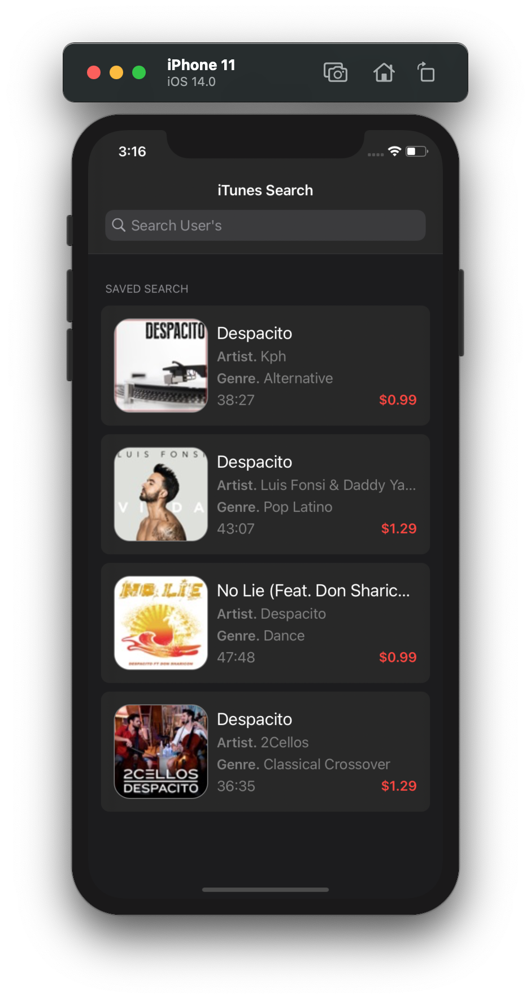
</a>
<a>
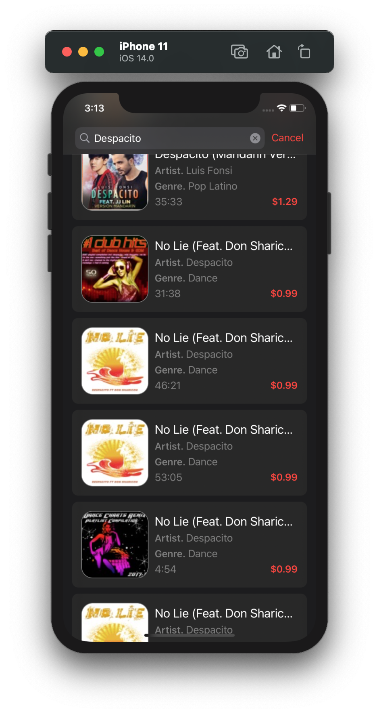
</a>
<a>
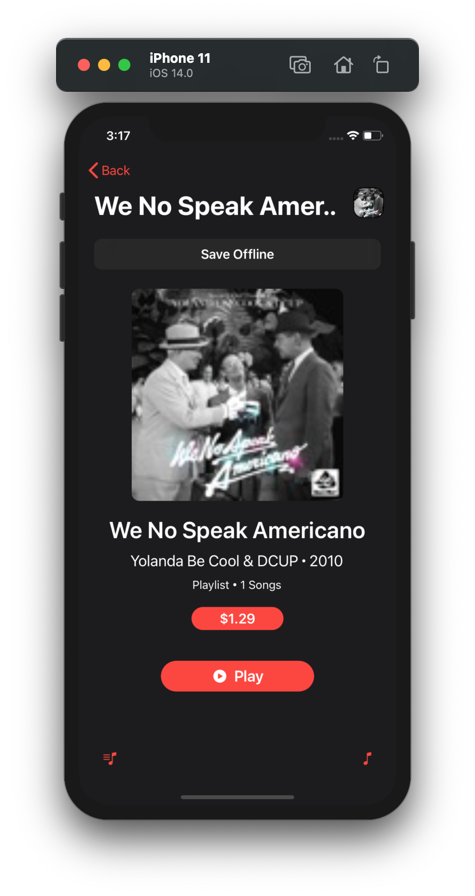
</a>
  <a>
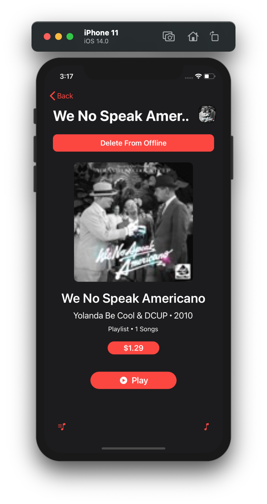
</a>
  <a>
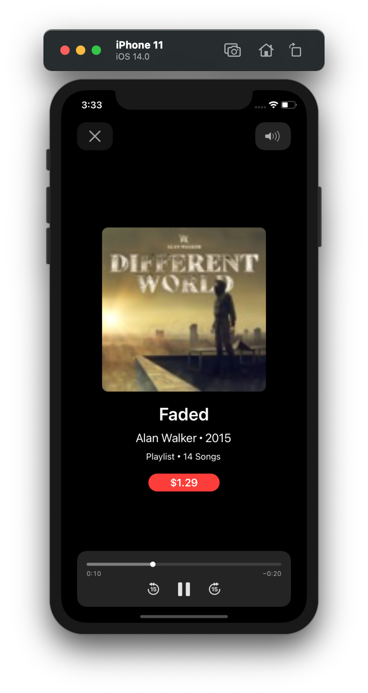
</a>
  

## iPhone 11 White Mode

<a>
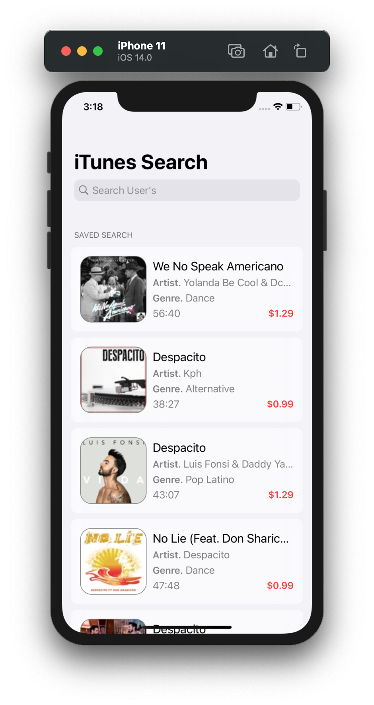
</a>
<a>
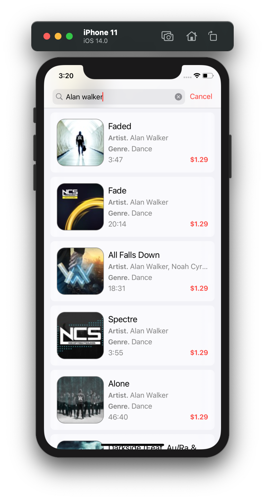
</a>
 <a>
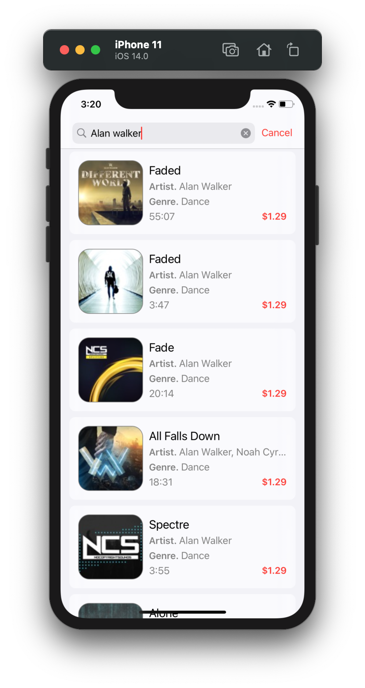
</a>

<a>
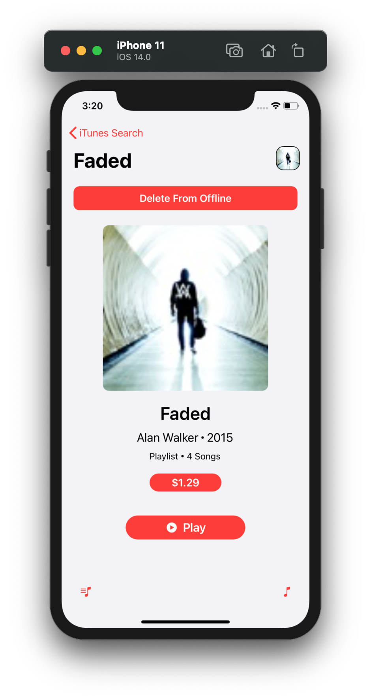
</a>

## iPhone 6 Dark Mode

<a>
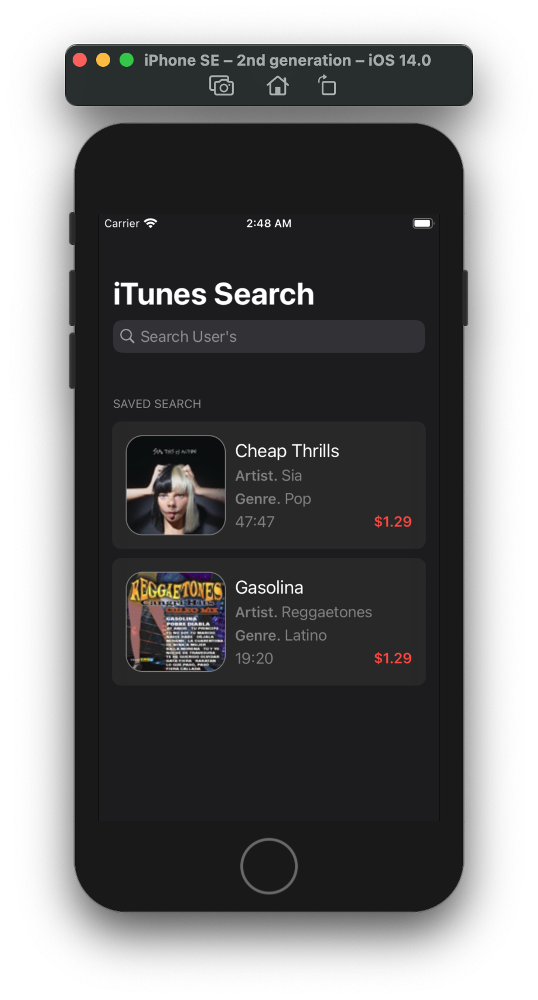
</a>
<a>
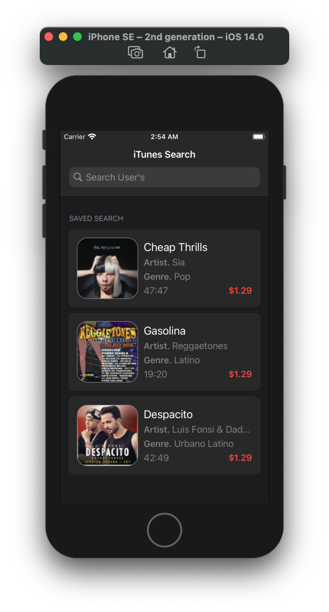
</a>
<a>
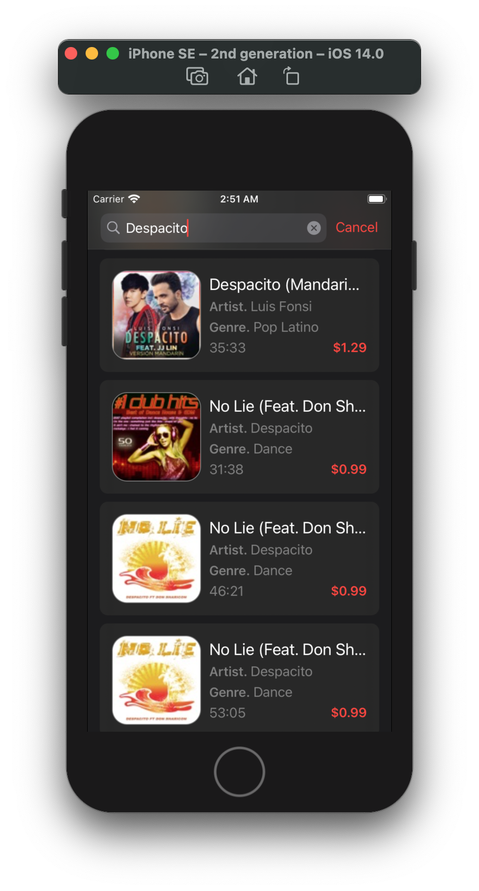
</a>
<a>
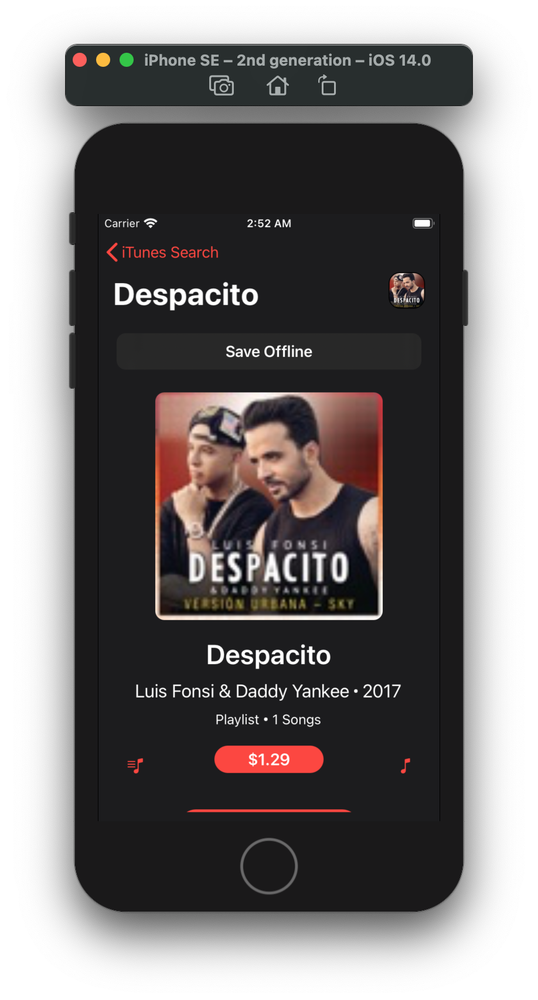
</a>
  <a>
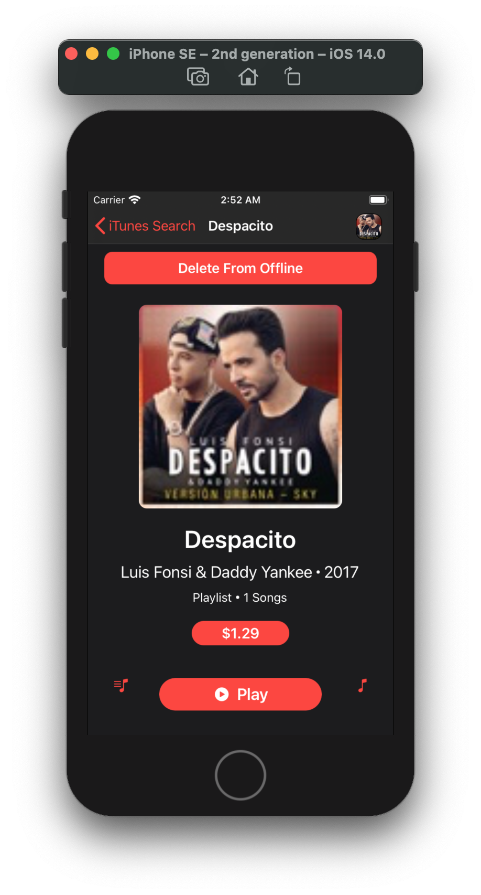
</a>
  <a>
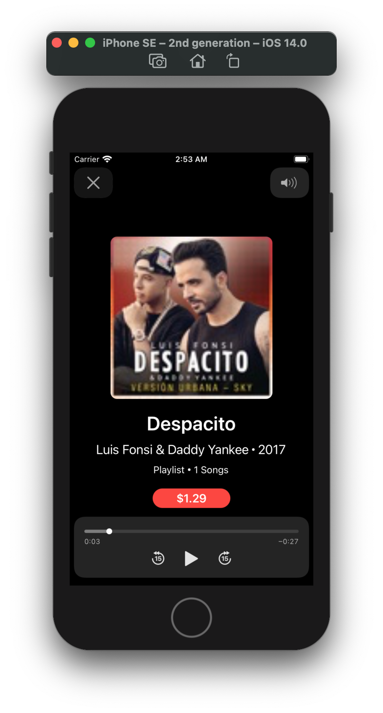
</a>
  <a>
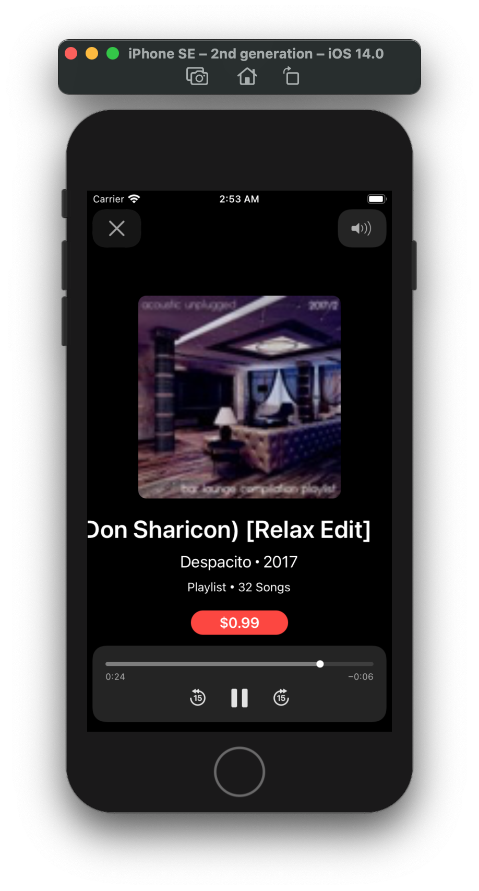
</a>

## iPhone 6 White Mode

<a>
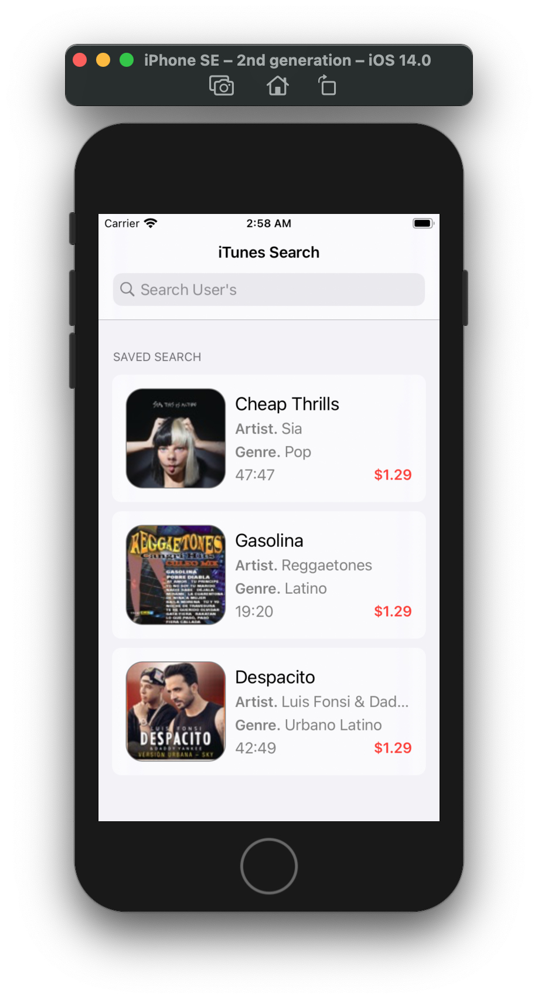
</a>

 <a>
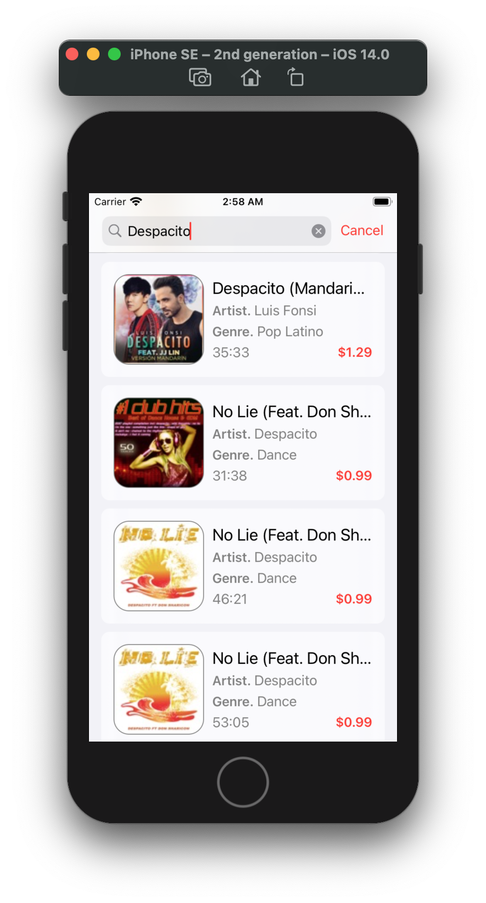
</a>

<a>
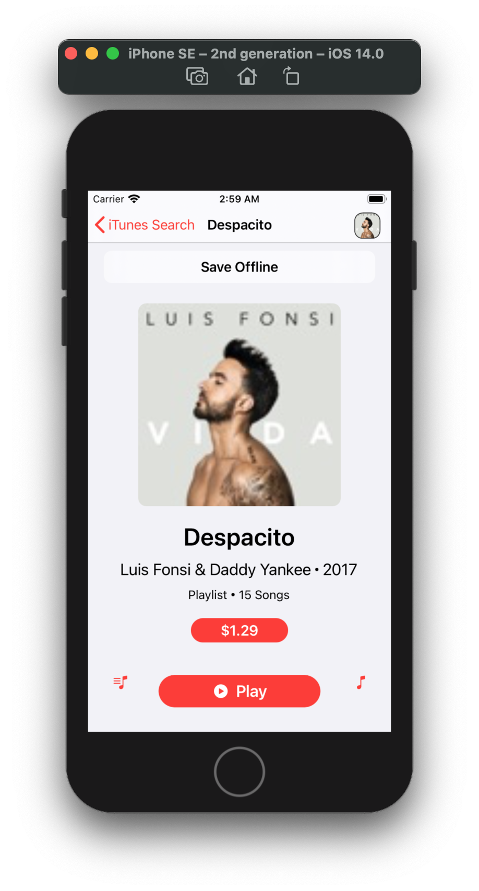
</a>

